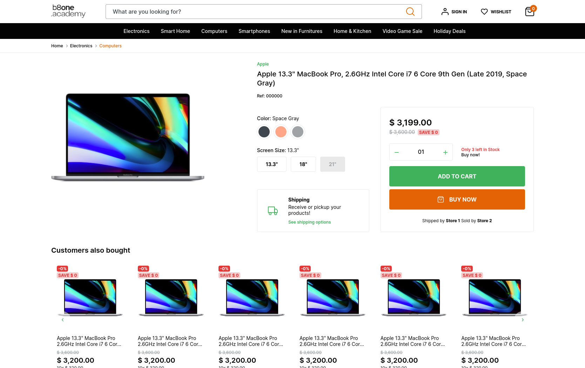

# Desafio Front End - b8one.academy

## Sobre

Desafio da primeira etapa eliminatória do curso de Desenvolvimento Front End promovido pela b8One Academy.

<a href="https://leottx.github.io/b8one-desafio-front-end/">Link de acesso 🔗</a>

## Instação

O modo de desenvolvimento é inicializado a partir dos passos a seguir:

1. Clone o repositório na sua máquina
2. Instale as dependências `npm install`
3. Execute o comando `npm run dev`
4. Pronto! A aplicação será aberta na url <a href="http://localhost:9000">http://localhost:9000/</a>
